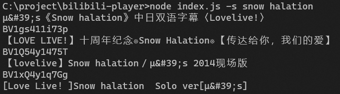
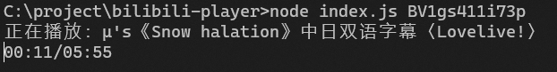

# bilibili-player

在命令行中打开bilibili视频黑听的工具

缺点是比较慢（

## 命令行传参

### 搜索



搜不到的时候会报错

### 播放



## 命令模式

无参数运行时进入命令模式，可用命令如下所示

注意命令可以只打前缀

| 命令 | 说明 | 示例 |
|---|---|---|
| search | 搜索视频 | s 爱丽丝 茶会 |
| play | 播放视频 | p BV1FX4y1g7u8 |
| play | 按序号播放上次搜索到的视频 | p 1 |
| live | 按直播间号打开直播 | l 213 |
| help | 打开帮助（然而什么都没有） | h |
| quit | 退出 | q |

## 安装依赖

```shell
npm install
```

## 配置文件

config.json放在index.js目录下，用于配置proxy

直连配置文件中不需要写proxy属性

```json
{
}
```

如果连接代理的话，proxy格式参考<https://playwright.dev/docs/api/class-browsertype#browser-type-launch>

```json
{
    "proxy": {
        "server": "yourserver"
    }
}
```

## 编译和运行

编译

```shell
npm run compile
```

运行

```shell
npm run start
```

## 已知问题

Q: 为什么这么慢

A: 低技术力是这样的

Q：报错了报错了报错了

A：正常。搜索的时候报错可能是因为搜不到。

Q：为什么播放没有声音

A：因为bilibili可能会自动静音，这点xyq也很苦恼呢

Q：为什么会自动连播

A：因为代码里没有相关限制……虽然有想过加上，但是这样就不能简单实现多P视频的播放了（所以就是xyq懒）而且现在多P不会显示播放时间

Q：可以中断播放吗

A：不可以，不过如果想随时中断程序的话多按Ctrl+C就可以了

捏麻麻滴，怎么这么多BUG😨

## 推荐

[aynakeya](https://github.com/aynakeya)的bilibili系列工具都很棒
